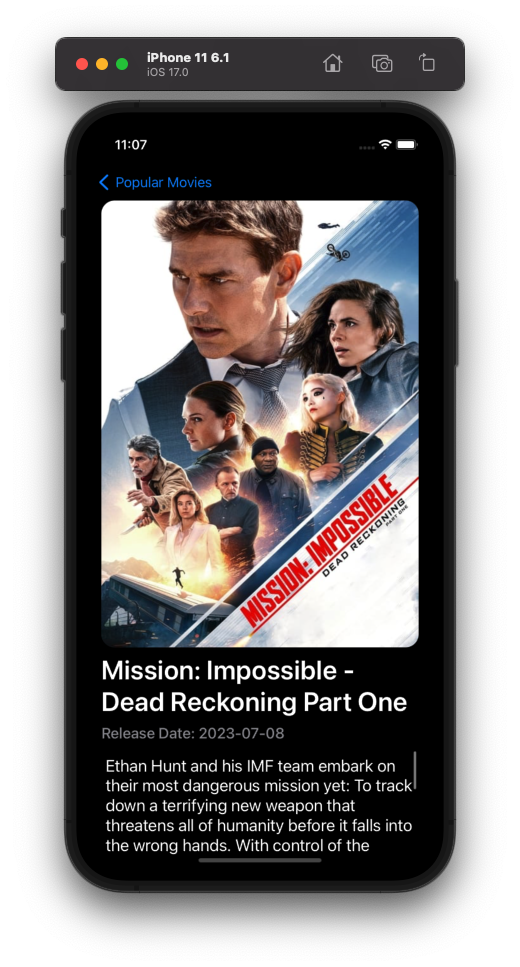

# :sparkles: PopularMovies-MVVM-ProgrammaticUI

*Networking:* URLSession, Generic Network Manager
*UI:* No storyboard, Programmatic UI
*&:* The retain cycle for memory leaks was taken into account.

